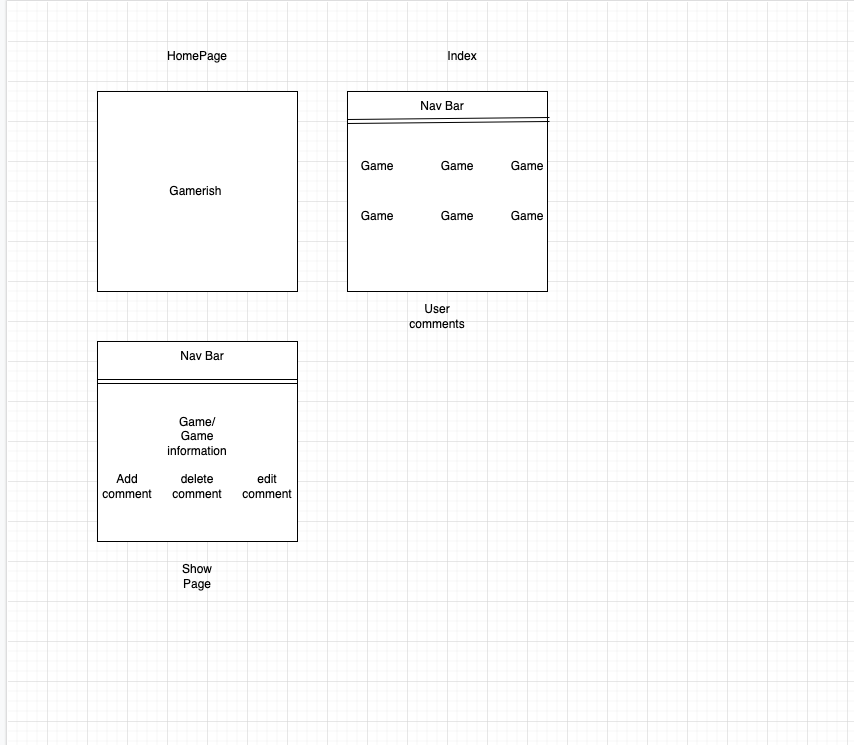
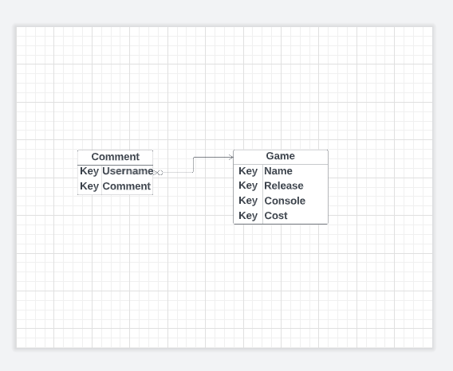

# **GAMERISH :joystick:**


### A CRUD base application. GAMERISH is a gaming review blog site. Create a post. Discuss what you like about aginst. Rant about what you don't. Talk about all things gamerish. 


The project demostration a knowledge in the following... 

1. CRUD 
2. Node.js
3. Express
4. JSX
5. Mongoose 
6. Javascript
7. HTML
8. CSS
9. React

### Restful Route Table 

|   #	|   Action	|   URL	|  HTTP Verb. 	|   JSX view filename	|   mongoose method	|
|---	|---	    |---	|---	        |---	                |---	            |
|   1	|  Index 	|  / 	|  get 	        |   Index.jsx	            |   Log.find()	            |
|   2	|  New 	    |  /new |  get 	        |   New.jsx	                |   none	            |
|   3	|  Delete 	|  /:id |  delete       |   none	                |   Log.findByIdAndDelete()	            |
|   4	|  Update 	|  /:id	|  put 	        |   none	                |   Log.findByIdAndUpdate()	            |
|   5	|  Create 	|  /	|  post         |   none	                |  Log.create(req.body) 	            |
|   6	|  Edit 	|/:id/edit|get   	    |   Edit.jsx                |   Log.findById()	            |
|   7	|  Show 	|  /:id	|  get  	    |   Show.jsx                |    Log.findById()		            |  

## Requirements/Getting Started 
For development, you will need Node.js installed in your environemnt along with the following... 

**Package.json**
```js
{
  "name": "project_2",
  "version": "1.0.0",
  "description": "",
  "main": "server.js",
  "scripts": {
    "test": "echo \"Error: no test specified\" && exit 1",
    "start": "node server.js",
    "dev": "nodemon"
  },
  "keywords": [],
  "author": "",
  "license": "ISC",
  "dependencies": {
    "bcryptjs": "^2.4.3",
    "connect-mongo": "^4.6.0",
    "dotenv": "^16.0.3",
    "express": "^4.18.2",
    "express-session": "^1.17.3",
    "jsx-view-engine": "^0.1.0",
    "method-override": "^3.0.0",
    "mongoose": "^6.7.0",
    "react": "^18.2.0",
    "react-dom": "^18.2.0"
  },
  "devDependencies": {
    "nodemon": "^2.0.20"
  }
}
```

### Node Resources
- [official Node.js website](https://nodejs.org/) and download the installer.
- [npmjs](https://www.npmjs.com/) *Remember look up all npm install*

## Project Planning Phase 

Trello Board:
[Trello Board](https://trello.com/b/Xw2PkESb/gaming-review-site)

*Wireframe*


*Entity–relationship model*



## Main Mongoose Model **Comment Model**

```js 
const mongoose = require('mongoose')

const commentSchema = new mongoose.Schema(
  {
    username: { type: String, require: true },
    text: { type: String, require: true },
    gameId: { type: String, require: true }
  }
)

const Comment = mongoose.model('Comment', commentSchema)

module.exports = Comment
```

## Favorite JSX **Show.jsx** 
```js
<ul className='commentContainer'>
                    {
                        this.props.game.comments.map((comment) => {
                            const { username, text, gameId } = comment
                            console.log(comments)
                            return (
                                <li key={comment._id} className='commentBox'>
                                    {comment.username}:<br />
                                    {comment.text}
                                    <div class='gameText'>
                                        <form action={`/games/${comment._id}/comment?_method=DELETE`} method='POST'>
                                            <input type='submit' value={`Delete Comment`} />
                                        </form>
                                        <a href={`/games/${gameId}/${comment._id}/editComment`}><input type='button'/>Edit</a>
                                    </div>
                                </li>
                            )
                        })
                    }
                </ul>
```

## Controller for Main Model **use both** 

```js 
const gameDataController = require('./gameDataController')
const gameViewController = require('./gameViewController')
const commentDataController = require('./commentDataController')
const commentViewController = require('./commentViewController')
```

## BIGGEST CHALLENGE 

My biggest challenege was the comment functionality. 

## KEY LEARNING AND KEY TAKEAWAY 

My biggest takeaway was gaining a deeper understanding of objects. I'm pretty sure I am tramzatized by the *Cannot GET* error. 	:face_exhaling:  

## Things I want to add 
- :pushpin: Login Authentication to allow a user to only edit, delete, and post comments under their username.  
- :pushpin: Authorization to only allow an admin to upload games. 
- :pushpin: Third party API to provide data regarding current ratings and prices. *Twich has a third party API, for free if you have a twicth memeber and set up two step authentication.*
- :pushpin: Play around with the CSS to make website more appealing 
- :pushpin: Develop a navigation bar with for different console that contains games for that specific console. 

## Contributions:

**:fire:Third Degree Burns:fire:**
- General Assembly's Instructional Team :clap:  
- Youtube

## Q&A??  


